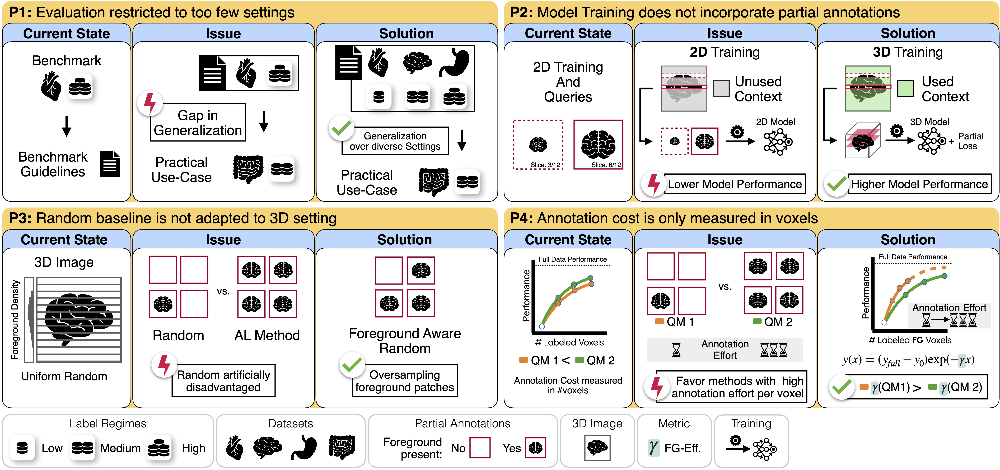

<p align="center">
    
    <br/>
</p>

<!-- # nnActive -->
## *A Framework for Evaluation of Active Learning in 3D Biomedical Segmentation*

#### :books: Abstract
> Semantic segmentation is crucial for various biomedical applications, yet its reliance on large annotated datasets presents a significant bottleneck due to the high cost and specialized expertise required for manual labeling. Active Learning (AL) aims to mitigate this challenge by selectively querying the most informative samples, thereby reducing annotation effort. However, in the domain of 3D biomedical imaging, there remains no consensus on whether AL consistently outperforms Random sampling strategies. Current methodological assessment is hindered by the wide-spread occurrence of four pitfalls with respect to AL method evaluation. These are (1) restriction to too few datasets and annotation budgets, (2) training 2D models on 3D images and not incorporating partial annotations, (3) Random baseline not being adapted to the task, and (4) measuring annotation cost only in voxels. In this work, we introduce nnActive, an open-source AL framework that systematically overcomes the aforementioned pitfalls by (1) means of a large scale study evaluating 8 Query Methods on four biomedical imaging datasets and three label regimes, accompanied by four large-scale ablation studies, (2) extending the state-of-the-art 3D medical segmentation method nnU-Net by using partial annotations for training with 3D patch-based query selection, (3) proposing Foreground Aware Random sampling strategies tackling the foreground-background class imbalance commonly encountered in 3D medical images and (4) propose the foreground efficiency metric, which captures that the annotation cost for background- compared to foreground-regions is very low. We reveal the following key findings: (A) while all AL methods outperform standard Random sampling, none reliably surpasses an improved Foreground Aware Random sampling; (B) the benefits of AL depend on task specific parameters like number of classes and their locations; (C) Predictive Entropy is overall the best performing AL method, but likely requires the most annotation effort; (D) AL performance can be improved with more compute intensive design choices like longer training and smaller query sizes. As a holistic, open-source framework, nnActive has the potential to act as a catalyst for research and application of AL in 3D biomedical imaging.

<p align="center">
    <figure class="image">
        
        <figcaption style="font-size: small;">
        Visualization of the four Pitfalls (P1-P4) alongside our solutions and how their presence hinders reliable performance assessments of AL methods for 3D biomedical imaging. For visualization purposes, we use 2D slices as partial annotations.
        </figcaption>
    </figure>
</p>


### :scroll: Citing This Work

If you use nnActive, please cite our [paper](https://openreview.net/forum?id=AJAnmRLJjJ)
<!-- 
TODO: INSERT REFERENCE ONCE PUBLISHED
```bibtex
```
-->

### **Contents:**
Scripts for nnActive installation, usage, and development.
- **nnActive**
    - [Installation](#installation)
    - [Set up nnActive](#set-up-nnactive)
    - [Autocompletion](#autocompletion)
    - [Setting up the data](#setting-up-the-data)
    - [Active Learning Experiment](#active-learning-experiment)
    - [Analysis](#analysis)
    - [Dataset Requirements](#requirements)
    - [Additional Labels](#additional-labels-path)
    - [Active Learning Integration](#active-learning-integration)
    - [Contributing](#contributing)
- [📊 **Benchmark Results**](#benchmark-results)
- [🛠️ **How to benchmark a new AL method?**](#adding-a-new-al-method)
- [Acknowledgements](#acknowledgements)

---

## Installation

Install with
```bash
# use Pytorch 2.4.0 and CUDA 12.4
pip install torch torchvision torchaudio --index-url https://download.pytorch.org/whl/cu124
pip install -e nnunetv2
pip install -e nnactive '.[dev]'
```

We recommend a swap memory size of ≥128GB to avoid OOM issues.

## Set up nnActive
Set up paths as follows:
```bash
export nnActive_raw=Path_to_raw_nnunet_data # contains base datasets are derived
export nnActive_data=Path_to_nnactive_data # contains data for Active Learning experiments
export nnActive_results=$nnActive_data # contains results from Active Learning experiments
export nnUNet_raw=$nnActive_raw/nnUNet_raw # base_datasets (ID)
export nnUNet_preprocessed=$nnActive_raw/nnUNet_preprocessed # base datasets (ID)
export nnUNet_results=Path_to_nnUnet_results # base datasets (ID)
```
### Autocompletion

#### Usage:
```bash
nnactive setup_experiment --experiment <tab>
nnactive run_experiment --experiment <tab>
```
#### Set up on ZSH:
write completion file
```bash
nnactive -s zsh > $HOME/.local/bin/completions/_nnactive
```
Add to fpath
```
fpath+="$HOME/.local/bin/completions"
```
#### Set up on Oh-my-zsh:
write completion file
```bash
nnactive -s zsh > $HOME/.oh-my-zsh/completions/_nnactive
```

#### Add a new function to CLI
Add import to file which carries function in: `nnactive/cli/__init__.py`

### Setting up the data
Each dataset needs to be in the standard nnU-Netv2 format.
E.g. do so with the Medical Segmentation Decathlon Hippocampus Dataset
Create Raw Data:
```bash
nnUNetv2_convert_MSD_dataset -i {Path-to}/Task04_Hippocampus
```
Inside of these paths the following files 
```bash
$nnUNet_raw
├── Dataset004_Hippocampus
│   ├── dataset.json
│   ├── imagesTr
│   └── labelsTr
...
```

Now create the seperation into validation and training set for Active Learning.
```bash
nnactive init_create_val_split --dataset_id 4 
```
```bash
$nnUNet_raw
├── Dataset004_Hippocampus
│   ├── dataset.json
│   ├── imagesTr
│   ├── imagesVal
│   ├── labelsTr
│   └── labelsVal
...
```

Now set everything into the spacing used for the nnU-Net configuration.
```bash
nnUNetv2_plan_and_preprocess -d 4 -c 3d_fullres -np 8
nnactive init_resample_from_id --dataset_id 4 
```
```bash
$nnUNet_raw
├── Dataset004_Hippocampus
│   ├── dataset.json
│   ├── imagesTr #resampled data
│   ├── imagesTr_original 
│   ├── imagesVal #resampled data
│   ├── imagesVal_original
│   ├── labelsTr #resampled data
│   ├── labelsTr_original
│   ├── labelsVal #resampled data
│   └── labelsVal_original
...
```

Creation of small derivative datasets
```bash
nnactive nnactive init_create_small_dataset ----base_dataset_id 4 --target_dataset_id 999
```
```bash
$nnUNet_raw
├── Dataset004_Hippocampus
│   ├── dataset.json
│   ├── imagesTr #resampled data
│   ├── imagesTr_original 
│   ├── imagesVal #resampled data
│   ├── imagesVal_original
│   ├── labelsTr #resampled data
│   ├── labelsTr_original
│   ├── labelsVal #resampled data
│   └── labelsVal_original
├── Dataset999_Hippocampus_small
│   ├── dataset.json
│   ├── imagesTr #resampled data
│   ├── imagesVal #resampled data
│   ├── labelsTr #resampled data
│   └── labelsVal #resampled data
...
```


## Active Learning Experiment
After the base dataset has been set up we create an experiment with the setup function
```bash
nnactive setup_experiment --experiment Hippocampus__patch-20_20_20__sb-random-label2-all-classes__sbs-40__qs-40__unc-random__seed-12345
```
This creates the following folders:
```bash
$nnActive_data
├── Dataset004_Hippocampus # base_dataset folder
│   ├── nnUNet_preprocessed
│   │   ├── Dataset000_Hippocampus__patch-20_20_20__sb-random-label2-all-classes__sbs-40__qs-40__unc-random__seed-12345
│   │   │   ├── nnUNetPlans.json
│   │   │   ├── gt_segmentations
│   │   │   └── nnUNetPlans_3d_fullres
│   ├── nnUNet_raw
│   │   ├── Dataset000_Hippocampus__patch-20_20_20__sb-random-label2-all-classes__sbs-40__qs-40__unc-random__seed-12345
│   │   │   ├── loop_000.json # contains annotated patches
│   │   │   ├── imagesTr -> $nnActive_raw/nnUNet_raw/Dataset004_Hippocampus/imagesTr
│   │   │   ├── imagesTs -> $nnActive_raw/nnUNet_raw/Dataset004_Hippocampus/imagesTs
│   │   │   ├── imagesVal -> $nnActive_raw/nnUNet_raw/Dataset004_Hippocampus/imagesVal
│   │   │   ├── labelsTr # contains data with ignore label where only patches are annotated
│   │   │   ├── labelsVal -> $nnActive_raw/nnUNet_raw/Dataset004_Hippocampus/labelsVal
│   │   │   └── labelsVal -> $nnActive_raw/nnUNet_raw/Dataset004_Hippocampus/labelsVal
│   ...
...

$nnActive_results
├── Dataset004_Hippocampus # base_dataset folder
│   ├── nnActive_results
│   │   ├── Dataset000_Hippocampus__patch-20_20_20__sb-random-label2-all-classes__sbs-40__qs-40__unc-random__seed-12345
│   │   │   └── config.json
│   │   │   └── loop_000 # these will be created for validation and performance etc.
```

After the experiment has been set up, it can now be executed.
```bash
nnactive run_experiment --experiment Hippocampus__patch-20_20_20__sb-random-label2-all-classes__sbs-40__qs-40__unc-random__seed-12345
```

## Analysis
### Visualizing Results
To get a detailed analysis with plots and computed metrics for each different setting the following command can be used:
```bash
nnactive analyze_experiments --base_path $nnActive_results --raw_path $nnActive_data --output_path {OUTPUT_PATH}
```

This results in the following folder structure.
```
{OUTPUT_PATH}
├── DatasetXXX_NAME
│   ├── Setting 1
│   │   ├── results
│   │   ├── results_statistics
│   │   │   ├── Class X Dice
...
│   │   │   ├── Class Y Dice
│   │   │   └── Mean Dice
│   │   └── statistics
│   └── Setting 2
│       ├── results
│       ├── results_statistics
│       │   ├── Class X Dice
...
│       │   ├── Class Y Dice
│       │   └── Mean Dice
│       └── statistics
...
```

### Visualizing Queries (Images)
```bash
nnactive visualize_queries_images --raw_folder $nnActive_data/DatasetXXX/nnUNet_raw/DatasetXYZ --img_folder $nnActive_raw/nnUNet_raw/ DatasetXXX --output_folder {OUTPUT_FOLDER}
```

Results in the following folder structure
```
{OUTPUT_FOLDER}/DatasetXYZ
├── loop_000
│   ├── loop-00__id-00__img-ACDC_01541.png
│   ├── loop-00__id-01__img-ACDC_00542.png
│   ├── loop-00__id-02__img-ACDC_01504.png
│   └── loop-00__id-19__img-ACDC_00260.png
├── loop_001
...
├── loop_002
...
├── loop_009
...
├── overview-loop_000.png
├── overview-loop_001.png
...
├── overview-loop_002.png
└── overview-loop_XXX.png
```


## Requirements
dataset.json in raw data
```json
{
    "channel_names": {
        "0": "MRI"
    },
    "description": "Left and right hippocampus segmentation",
    "file_ending": ".nii.gz",
    "labels": {
        "Anterior": 1,
        "Posterior": 2,
        "background": 0,
        "ignore": 3
    },
    "licence": "CC-BY-SA 4.0",
    "name": "Hippocampus-partanno",
    "numTest": 130,
    "numTraining": 260,
    "reference": " Vanderbilt University Medical Center",
    "relase": "1.0 04/05/2018",
    "tensorImageSize": "3D",
    "annotated_id" : 4 
    // id to annotated dataset 
}
```


## Additional labels path
Additional labels can be added in the `addTr` folder, these will then be written to the `labelsTr` folder.

Implementation checking overlap will be implemented in the future version.

## Active Learning Integration

The annotated data for each loop is saved in the `loop_XXX.json` file situated in the respective nnUNet_raw folder for each experiment.
These files are used for creating the validation splits for training.
It is structured as follows:
```json
{
    "patches": [
        {
            "file": "hippocampus_361.nii.gz",
            "coords": [
                0,
                0,
                0
            ],
            "size": "whole"
        },
        {
            "file": "hippocampus_230.nii.gz",
            "coords": [
                0,
                0,
                0
            ],
            "size": "whole"
        },...
    ]
    "metafile" : "xxx",
    ...
}
```
`"patches"` is used to save the annotated areas and in `loop_XXX.json` only the newly annotated areas are saved.
To recreate the dataset for `loop_002.json` needs to be aggregated with `loop_001.json` and `loop_000.json`.


## Contributing

- *Run `pre-commit install` every time you clone the repo*
- Turn on `pylint` in your editor, if it shows errors:
    1. Fix the error
    2. If it is a false positive or if you have a good reason to disagree in
       this instance add `# pylint: disable=<msg>` or `# pylint: disable-next=<msg>`
       (see [message control](https://pylint.readthedocs.io/en/latest/user_guide/messages/message_control.html) and [list of checkers](https://pylint.readthedocs.io/en/latest/user_guide/checkers/features.html))
    3. If you think this error should never be reported add it to `pyproject.toml`
        ```toml
        [tool.pylint]
        disable = [
            <msg 1>,
            <msg 2>,
            ...
        ]
        ```

# 📊 Benchmark Results <a id="benchmark-results"></a>
We provide all benchmark results [on huggingface 🤗](https://huggingface.co/nnActive)

To download the results for all experiments:
```bash
python assets/download_from_huggingface.py --help
```

# 🛠️ Benchmarking a new AL method <a id="adding-a-new-al-method"></a>

## Add Query Strategy
Make use of the `register_strategy` function to register new methods. You can use the existing method implementations as templates, e.g. Expected Entropy:
```python
from pathlib import Path
import torch

from nnactive.strategies.base_uncertainty import AbstractUncertainQueryMethod
from nnactive.strategies.registry import register_strategy
from nnactive.strategies.uncertainties import Probs

# Inherit from AbstractUncertainQueryMethod for QMs based on predicted
# class probability distributions.
@register_strategy("pred_entropy")
class ExpectedEntropy(AbstractUncertainQueryMethod):
    # The core of the QM implementation
    def get_uncertainty(
        self, probs: list[Path] | torch.Tensor | Probs, device: torch.device
    ) -> torch.Tensor:
        # Use the Probs (ProbsFromFiles) class (at strategies/uncertainties.py).
        # This automatically combines probability maps from temporary files.
        if not isinstance(probs, Probs):
            probs = Probs.create(probs)
        return probs.exp_entropy(probs, device=device)
```

## Add Experiment Configurations
Register new experiments to make them available in the CLI.

```python
from nnactive.experiments import register, make_hippocampus_config

register(
    make_hippocampus_config,  # our default Hippocampus configuration
    seeds=list(i + 12345 for i in range(4)),
    uncertainties=["my_qm"],  # as stored in the strategydict
    query_size=40,  # medium label regime
    query_steps=5,  # 5 AL cycles
)
```

## Run new Experiments
```bash
nnactive setup_experiment --experiment Hippocampus__patch-20_20_20__sb-random-label2-all-classes__sbs-40__qs-40__unc-my_qm__seed-12345
nnactive run_experiment --experiment Hippocampus__patch-20_20_20__sb-random-label2-all-classes__sbs-40__qs-40__unc-my_qm__seed-12345
```

## Acknowledgements

<br>

<p align="center">
  <!--  &nbsp;&nbsp;&nbsp;&nbsp; -->
   &nbsp;&nbsp;&nbsp;&nbsp;
  
</p>
